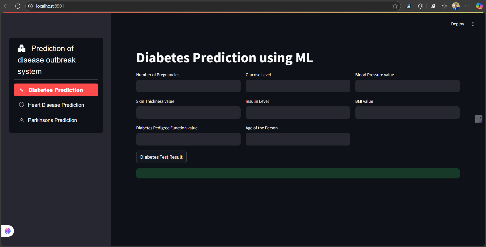

# Multi-Disease Prediction Web App

A Streamlit application that runs three tabular machine-learning classifiers for diabetes, heart disease, and Parkinson's disease.

The project is intended for learning and portfolio demonstration. Its outputs are model classifications, not medical diagnoses, and should not be used for clinical decisions.



## What the project does

The application accepts numeric or coded tabular inputs and passes them to one of three trained scikit-learn models.

| Task | Baseline model | Inputs | Target |
| --- | --- | ---: | --- |
| Diabetes | Linear SVM | 8 | `Outcome` |
| Heart disease | Logistic regression | 13 | `target` |
| Parkinson's disease | Linear SVM | 22 | `status` |

The historical notebooks reported test accuracies of approximately 75.3% for diabetes, 82.0% for heart disease, and 87.2% for Parkinson's disease. Those values are from single holdout splits and are not clinical validation results.

## Improvements in the maintained version

The original project was reorganized so that training, inference, model paths, feature definitions, tests, and documentation are no longer mixed together.

The maintained version includes:

- repository-relative model and dataset paths;
- one shared feature definition for training and inference;
- field descriptions and coded-value explanations in the Streamlit app;
- input validation for blank, non-finite, and incorrect feature counts;
- dataset schema validation before training;
- reproducible model training from the included CSV files;
- accuracy, balanced accuracy, precision, recall, F1, ROC-AUC, and confusion matrices;
- dataset hashes and environment versions in the generated metrics report;
- automated tests and Ruff checks in GitHub Actions;
- explicit limitations for each dataset and model.

## Project structure

```text
Multi-Disease-Prediction-Web-App/
├── .github/
│   └── workflows/
│       └── ci.yml
├── assets/
│   └── app-screenshot.png
├── data/
│   ├── diabetes.csv
│   ├── heart.csv
│   └── parkinsons.csv
├── docs/
│   ├── DATA_DICTIONARY.md
│   ├── MODEL_CARD.md
│   └── project-report.pdf
├── models/
│   ├── diabetes_model.sav
│   ├── heart_disease_model.sav
│   └── parkinsons_model.sav
├── notebooks/
│   └── archive/
│       ├── diabetes.ipynb
│       ├── heart_disease.ipynb
│       └── parkinsons.ipynb
├── reports/
│   └── metrics.json              # generated after retraining
├── scripts/
│   ├── __init__.py
│   └── train_models.py
├── src/
│   ├── __init__.py
│   ├── model_io.py
│   ├── prediction.py
│   └── specs.py
├── tests/
│   ├── test_model_io.py
│   ├── test_prediction.py
│   ├── test_project_structure.py
│   ├── test_specs.py
│   └── test_training_validation.py
├── .gitignore
├── app.py
├── pyproject.toml
├── requirements-dev.txt
├── requirements.txt
└── README.md
```

## Datasets

### Diabetes

The repository contains 768 rows, eight input features, and a binary `Outcome` target. The schema matches the commonly distributed Pima Indians Diabetes dataset.

The exact original download location used for this repository is not recorded, so the project does not claim a specific source copy until that provenance is confirmed.

### Heart disease

The repository contains 303 rows, 13 model features, and a binary `target`. Its schema is a commonly used recoded form of the Cleveland heart-disease data documented by the UCI Machine Learning Repository.

The local CSV uses integer encodings for categorical fields such as chest-pain type, resting ECG, ST-segment slope, and thal. Those encodings are shown directly in the app.

### Parkinson's disease

The repository contains biomedical voice measurements with 22 model features. `status` is the binary target and `name` identifies the subject/recording.

The data corresponds to the Parkinson's dataset distributed through the UCI Machine Learning Repository.

See [`docs/DATA_DICTIONARY.md`](docs/DATA_DICTIONARY.md) for the complete field definitions and coding notes.

## Installation

Python 3.12 is recommended.

Create a virtual environment:

```bash
python -m venv .venv
```

Windows:

```bat
.venv\Scripts\activate
```

Linux/macOS:

```bash
source .venv/bin/activate
```

Install runtime dependencies:

```bash
python -m pip install --upgrade pip
python -m pip install -r requirements.txt
```

## Run the Streamlit app

```bash
streamlit run app.py
```

The application loads trusted model artifacts from `models/`. It does not depend on machine-specific absolute paths.

The form uses drop-downs for coded heart-disease variables and includes an expandable field guide explaining the remaining numeric inputs.

## Retrain the models

Run:

```bash
python -m scripts.train_models
```

The script:

1. reads the three CSV files from `data/`;
2. verifies the required schema;
3. selects features in the same order used by the app;
4. trains the baseline model family for each task;
5. saves `.sav` artifacts into `models/`;
6. writes evaluation and reproducibility information to `reports/metrics.json`.

The generated report contains:

- accuracy;
- balanced accuracy;
- precision;
- recall;
- F1 score;
- ROC-AUC;
- confusion matrix;
- train/test row counts;
- class counts;
- dataset SHA-256 digests;
- Python, pandas, and scikit-learn versions.

## Baseline training setup

### Diabetes

- target: `Outcome`
- split: 80/20
- random state: 42
- model: `SVC(kernel="linear")`

### Heart disease

- target: `target`
- split: 80/20 with stratification
- random state: 2
- model: `LogisticRegression(max_iter=1000)`

The higher iteration limit prevents the convergence warning seen in the historical notebook without changing the model family.

### Parkinson's disease

- ID column excluded: `name`
- target: `status`
- split: 80/20
- random state: 2
- model: `SVC(kernel="linear")`

The maintained baseline keeps the historical row-level split for reproducibility. A subject-level grouped split is a better future evaluation because multiple recordings can belong to the same person.

## Tests and code quality

Install development dependencies:

```bash
python -m pip install -r requirements-dev.txt
```

Run tests:

```bash
python -m pytest -q
```

Run Ruff:

```bash
ruff check .
```

GitHub Actions runs both checks on pushes and pull requests.

The tests cover input parsing, binary prediction handling, model-file safety checks, feature metadata, required repository assets, and training-dataset schema validation.

## Important limitations

This project should not be presented as a diagnostic or screening system.

- The datasets are small.
- Evaluation is based on simple holdout splits.
- There is no external clinical validation.
- There are no calibrated probabilities or clinically selected thresholds.
- There is no subgroup or fairness analysis.
- The Parkinson's dataset contains repeated recordings from subjects, making subject-level evaluation preferable.
- The diabetes CSV contains physiologically implausible zero values in some measurement fields; the baseline workflow does not impute them.
- The two SVM baselines do not use feature scaling because the maintained baseline preserves the original modeling approach.
- Pickled models are dependent on trusted artifacts and compatible Python/scikit-learn versions.

See [`docs/MODEL_CARD.md`](docs/MODEL_CARD.md) for a more detailed model review.

## Future improvements

Useful next experiments would be:

- compare scaled scikit-learn pipelines using cross-validation;
- use subject-level grouped splitting for Parkinson's disease;
- evaluate missing-value handling for the diabetes dataset;
- compare simple baselines with additional classifiers;
- add confidence intervals around evaluation metrics;
- evaluate calibration before showing probabilities;
- document the exact original diabetes dataset download source;
- deploy the Streamlit app after validating the regenerated model artifacts in a clean environment.

## References

- UCI Machine Learning Repository — Heart Disease dataset
- UCI Machine Learning Repository — Parkinson's dataset

The exact provenance of the repository's diabetes CSV should be added once it is confirmed from the original project notes or download history.
